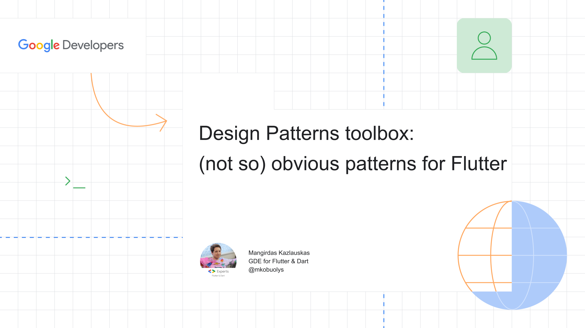

# Patternify - Fluter Design Patterns example app for the conference talk.



This example app shows how different Design Patterns could be used together in order to create a single application.

Design Patterns used in the app:

- Abstract Factory
- Composite
- Command
- Memento

Too learn more about other Design Patterns, feel free to check the [Flutter Design Patterns repository](https://github.com/mkobuolys/flutter-design-patterns).

## Presentation

Presentation slides are provided [here](presentation-slides.pdf).

Talk video could be found here: TBD

## Building

You can follow these instructions to build the app and install it onto your device.

### Prerequisites

If you are new to Flutter, please first follow the [Flutter Setup](https://flutter.dev/setup/) guide.

### Building and installing the Flutter Design Patterns app

```
git clone git@github.com:mkobuolys/flutter-design-patterns-talk.git
cd flutter-design-patterns-talk
flutter run
```

The `flutter run` command both builds and installs the Flutter app to your device or emulator.
